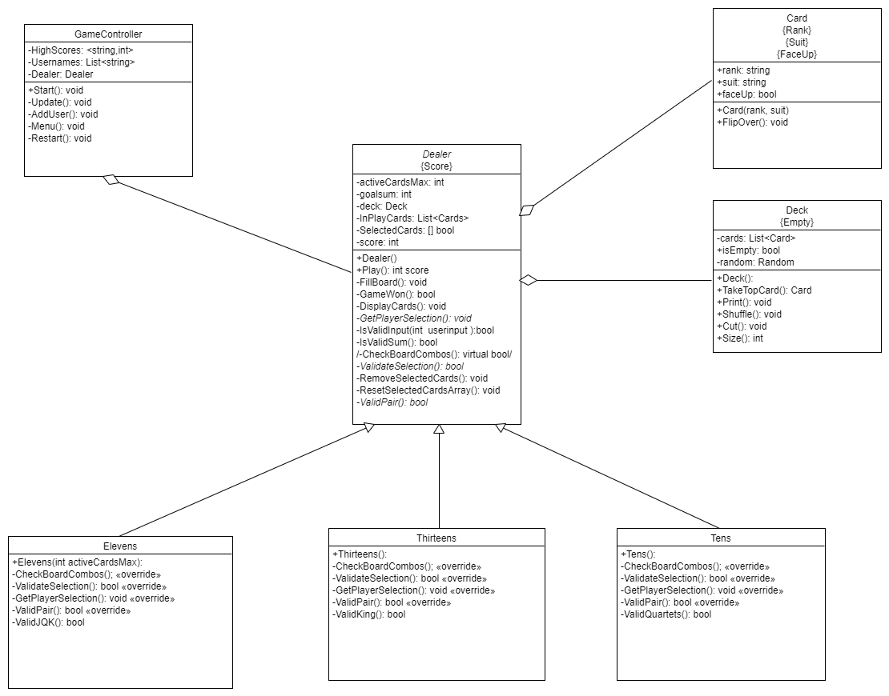
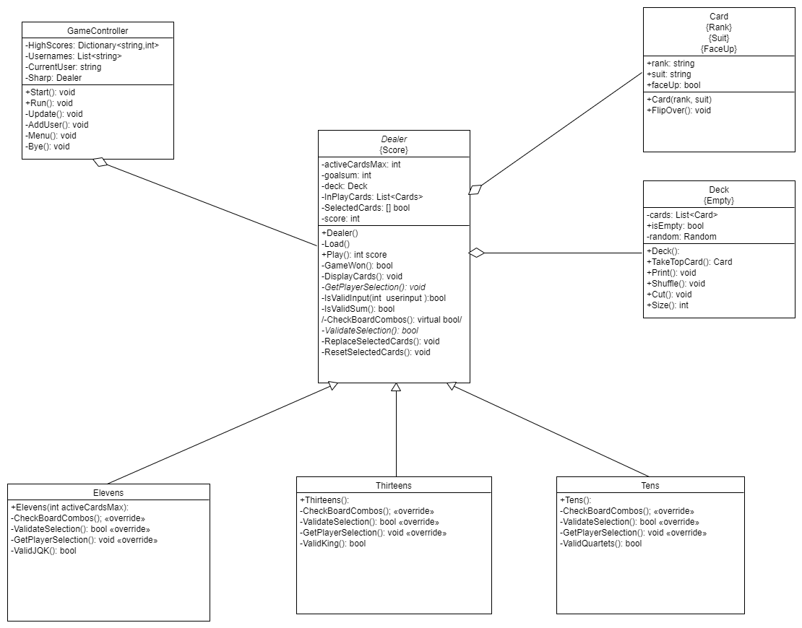

# MultiCardGame for CSC350H with Professor Hao Tang

###Problem Statement and Background
Using C# and and abstract base class, build out three playing card games, called Tens, Elevens, and Thirteens

Each game is played by combining pairs of cards that add to the value in the name. Aces are 1, Jacks are 11, Queens 12, and Kings 13.

Tens has a 13 card board and you can also choose 4 of a kind of 10, Jack, Queen, or King cards along with the pairs.
Elevens has a 9 card board and you can choose a trio of Jack, Queen, King to remove
Thirteens has a 10 card board and you can remove Kings by themself.

### UML

### Initial 

### Final (Mostly the same but consolidated some functions in the parent class)

